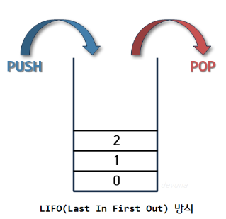
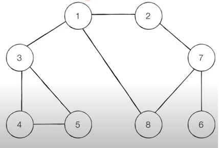
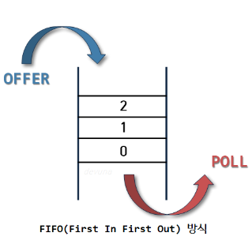

# 첫번째 주 - 큐,스택,코루틴,스레드

### **큐와 스택의 차이**

**1) 스택**

- 쌓아 올리는 형태의 자료구조이며, 후입선출의 구조를 가지고 있다.
- 스택은 정해진 방향으로만 쌓을 수 있고 top으로 정한 곳을 통해서만 데이터에 접근이 허용 됩니다.
- top 을 통해 삽입 연산을 하는 것을 push , top 을 통해 삭제 연산을 하는 것을 pop 이라고 하며 후입선출의 구조입니다.
- 스택은 일반적으로 고정된 크기를 가지고 있는데,  너무 많은 데이터 추가 / 재귀 호출 / 스택 크기 제한에 의해 더 이상의 데이터 추가가 불가능한 상태를 **스택 오버 플로우** 라고 합니다.
- 스택이 비어있는 상태에서 pop 연산을 시도할때 발생하는 오류를 **스택 언더플로우** 라고 합니다.
- Android 에서 사용되는 Stack 구조 예시 : Jetpack(androidx)의 fragment navigation

**#DFS(Depth-First Search)** 

깊이 우선 탐색 알고리즘 , 그래프에서 깊은 부분을 우선적으로 탐색하는 알고리즘 

- 스택 혹은 재귀 함수를 이용해 구현한다.

동작 예시 : 1>2>7>6>8>3>4>5 순서

**2) 큐**

- 선입선출의 구조를 가지고 있습니다.
- 삭제 연산이 수행되는 곳을 front, 삽입 연산이 이루어 지는 곳을 rear 라 하며, 
리어(rear)에서 이루어지는 삽입 연산은 인큐(Enqueue)라고 부르고 프론트(Front)에서 이루어지는 삭제 연산을 디큐(Dequeue)라고 부릅니다.
- Android 에서 사용되는 Queue 구조 예시 : 메세지 큐 (MessageQueue)

메세지 큐는 안드로이드에서 메시지를 보관하는 큐 자료구조로 Handler에 의해 관리됩니다.

**핸들러와 루퍼의 관계**:

- 핸들러는 메시지를 메시지 큐에 전송하고, 루퍼는 해당 메시지를 메시지 큐에서 가져와 처리합니다. 핸들러와 루퍼는 이러한 과정에서 함께 동작하여 다른 스레드 간의 통신을 효율적으로 처리합니다.

**Question** : 코루틴의 withContext 를 통해 다른 스레드로 통신하는 것과 핸들러로 통신하는 것의 차이점은 뭘까.

코루틴의 withContext는 비동기 작업과 UI 업데이트가 한 곳에서 처리하는 등의 작업을 할때 적합하며 , 핸들러는 메세지를 다른 스레드에 전송하여 통신하는 것에 적합하다.  

**#BFS(Breadth-First Search)** 

너비 우선 탐색 알고리즘 , 그래프에서 가까운 노드부터 우선적으로 탐색하는 알고리즘 

동작 예시 : 1>2>3>8>7>4>5>6 순서

### **스레드과 코루틴의 차이**

**1) Process**

메모리에 적재되고 CPU 자원을 할당받아 프로그램이 **실행되고 있는 상태** 

**2)Thread**

프로세스 내에서 동시에 진행되는 작업 갈래, 흐름의 단위 

- 작업의 단위 : Thread
    
    각 스레드가 독립적인 Stack 메모리 영역을 가진다.
    
    운영 체제의 커널에 의한 Context Switching을 통해 동시성을 보장한다.
    
- 스레드에서 특정 작업이 blocking(waiting)상태가 되면, 해당 스레드에서 다른 작업은 처리할 수 없습니다.  I/O 작업이 blocking 되면 해당 스레드는 blocking 된 작업이 완료될 때까지 다른 작업을 수행할 수 없습니다.
- 안드로이드에서의 스레드 종류 : MainThread , Background Thread

**3)Coroutine**

- 작업의 단위 : Coroutine Object
    
    작업의 단위를 Object로 축소하면서 하나의 스레드가 다수의 코루틴을 다룰 수 있기 때문에 작업 하나하나에 스레드를 할당하며 메모리 낭비, Context Switching 비용 낭비가 이루어지지 않는다. 
    
    (하나의 스레드에서 여러개의 코루틴이 실행 가능하고, 스레드 전환 시 소모되는 CPU가 적습니다.)
    
- 코루틴에서 선언된 스레드 내부의 특정 작업이 일시 중단(suspending)상태가 되면, 다른 작업을 처리할 수 있는 non-blocking 방식으로 동작합니다. 
Dispatcher.IO 와 같은 스레드에서 실행 중인 작업이 일시 중단될 때 해당 스레드가 다른 작업을 처리할 수 있도록 허용합니다.
- Kotlin Coroutine 라이브러리에서 사용되는 스레드 관리 도구  ( 스레드 지정을 결정하는 도구)
    - Dispatchers.Main: 안드로이드의 주 메인(UI) 스레드에서 동작합니다. UI 업데이트와 사용자 상호작용을 처리하기에 적합합니다.
    - Dispatchers.IO: 네트워크 요청, 파일 I/O 및 기타 입출력 작업을 처리하기에 적합한 스레드 풀입니다. 백그라운드에서 CPU를 많이 사용하지 않는 작업에 적합합니다.
    - Dispatchers.Default: CPU 집약적인 작업을 처리하기에 적합한 스레드 풀입니다. IO와 UI 작업을 포함한 일반적인 작업에 사용됩니다.
    - Dispatchers.Unconfined: 현재 실행 중인 스레드를 그대로 사용합니다. 특정 스레드에 구속되지 않으므로 사용 시 주의가 필요합니다.