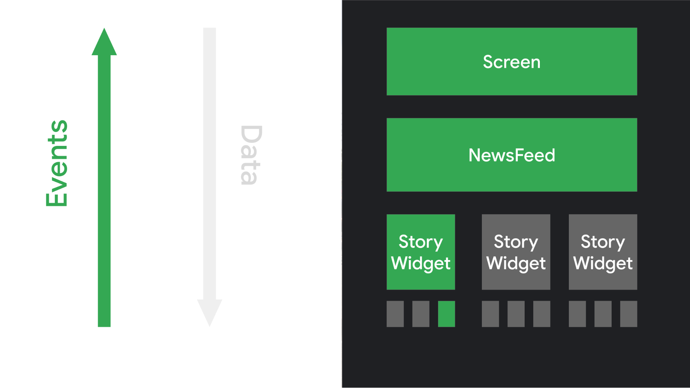

# Week02:Compose, 고차함수

### Compose를 사용해야하는 이유 , Compose vs XML

- 직관적이고 간결한 코드 , 상태 관리 효용성이 좋으며 xml 보다 커스텀 뷰를 만들기 수월합니다.
- 선언형 프로그래밍을 사용하여 기존의 명령형 UI 수정에 있어서 수동으로 조작하여 발생하는 오류(데이터를 표시하는 뷰 중 하나를 잊는 등)를 방지할 수 있으며 Stateful 뷰 계층 구조를 수동으로 업데이트 할 때의 복잡성을 방지할 수 있습니다.

### Compose 프레임의 세 단계

State는 세 개의 주요 단계에 걸쳐서 UI를 만들어냅니다. 

1. **컴포지션(Composition)**: Composable 함수를 실행해 **UI 트리**를 생성합니다. 
    
    생성된 UI 트리는 레이아웃 노드로 구성되며, 이는 다음 단계(Layout)을 수행하는데 영향을 미칩니다
    
2. **레이아웃(Layout)**: Layout 단계에서 트리의 각 노드를 각 **한번만** 방문하고 크기를 측정하여 2D 공간에 배치합니다.  이 때, Layout은 3단계의 알고리즘을 수행하여 노드를 탐색합니다.
    - child 노드 측정 : 노드의 자식들이 존재하면 크기를 측정한다.
    - 자체 크기 결정 : child 측정 값을 기반으로 현재 노드의 자체 크기를 결정한다.
    - child 노드 배치 : 자식 노드는 현재 노드의 위치에 상대적으로 배치된다.
    
3. **그리기(Drawing)**: Drawing 단계에서 트리는 위에서 아래로 다시 순회하고 각 노드는 차례로 화면에 자신을 그립니다. 그리기 코드 중 상태 읽기는 그리기 단계에 영향을 미칩니다. 

### Compose 에서 상태 호이스팅이란

자식 컴포저블의 상태를 부모 컴포저블로 끌어올려서 자식 컴포저블을 스테이트리스하게 만드는 패턴을 말합니다. 이렇게 자식 컴포저블 함수의 Stateless 하게 만드는 목적은 Recomposition 함으로 발생하는 컴퓨팅 성능 및 배터리 사용량 측면의 잠재적인 비용을 낮추기 위해서입니다. 이를 위해서는 State는 최소한 수정 할 수 있는 내에서 최고 수준으로 끌어올려야합니다.

**상태 호이스팅의 장점** 

- **단일 소스 저장소**: 여러 컴포저블에서 사용하는 상태를 단일로 저장한다.
- **캡슐화**: 스테이트풀(Stateful)한 부모만 상태를 수정 가능하다.
- **공유 가능**: 끌어올린 상태를 여러 Composable과 공유 가능하다.
- **가로채기 가능**: 스테이트리스(Stateless) 변경 함수는 상태를 변경하기 전에 이벤트를 무시할지 수정할지 결정할 수 있다.
- **분리됨**: 스테이트리스(Stateless) 상태는 어디에나 저장할 수 있다.

**Stateful 과 Stateless**

remember 를 사용하여 객체를 저장하는 컴포저블은 내부 상태를 생성하여 컴포저블을 스테이풀로 만듭니다. 내부 상태를 갖는 컴포저블은 재사용 가능성이 적고 테스트하기가 더 어려운 경향이 있습니다. 스테이트리스 컴포저블은 상태 호이스팅을 사용하여 구현할 수 있습니다.

상태 호이스팅을 적용하면 상태가 내려가고 이벤트가 올라가는 패턴이 되는데, 이 패턴을 **단방향 데이터 흐름(UDF)**이라고 합니다.  단방향 데이터 흐름을 따라 UI에 상태를 표시하는 컴포저블과 상태를 저장하고 변경하는 앱 부분을 서로 분리할 수 있습니다.

- **이벤트**: UI의 일부가 이벤트를 생성하여 위쪽으로 전달하거나(예: 처리하기 위해 ViewModel에 전달되는 버튼 클릭) 앱의 다른 레이어에서 이벤트가 전달됩니다(예: 사용자 세션이 종료되었음을 표시).
- **상태 업데이트**: 이벤트 핸들러가 상태를 변경할 수도 있습니다.
- **상태 표시**: 상태 홀더가 상태를 아래로 전달하고 UI가 상태를 표시합니다.

**remember { mutableStateOf() }**

Compose 에서는 remember API 함수를 사용하여 메모리에 객체를 저장할 수있으며 , 리컴포지션 후에도 MutableState 값이 유지됩니다. 

`mutableStateOf`객체를 활용하여 value가 변경되면 value를 읽는 구성 가능한 함수의 리컴포지션이 예약됩니다. 이러한 State를 위임받은 객체는 이 value 값을 사용하는 함수들에게 자동으로 Observing됩니다.

Compose 는 State<T> 객체를 읽어오면서 자동으로 리컴포지션을 실행하기 때문에 LiveData, Observable 한 또 다른 유형을 사용할 경우 LiveData.observeAsState() 와 같이 구성 가능한 확장함수를 사용하여 State<T>으로 변환해야합니다.

### **Compose의 SideEffect**

Composable 함수 외부에서 앱 상태가 변화하는 것을 부수 효과라고 합니다. Composable 함수는 메인 UI 스레드에서 실행하는 단일 스레드 모델로 동작하며, 예측할 수 없는 리컴포지션의 발생등의 이유로 기본적으로 Composable 함수 안에서는 코루틴을 사용할 수 없습니다. 하지만 그럼에도 Side Effect가 필요한 경우 Effect Api 를 사용하여 비동기적인 작업을 수행할 수 있습니다. ( 특정 조건 달성으로 인한 일회성 이벤트 트리거, 화면 이동 등)

**EffectApi - LaunchedEffect 함수**  

**`LaunchedEffect`**는 Jetpack Compose에서 안전한 정지 함수(suspend) 호출 , 비동기적인 작업을 수행할 때 사용하는 함수입니다.  특정한 조건이나 상태가 변경될 때 비동기적인 작업을 시작하고, 해당 작업이 완료되면 컴포저블 함수를 재호출해 UI를 업데이트할 수 있도록 도와줍니다.

### **함수형 프로그래밍**

**"순수 함수"**를 사용해, 상태를 제어하기보단, 빨리 처리하는데 초점을 둔 방법

실행 순서를 지정할 필요가 없기 때문에 비절차형 언어라고도 함

**순수함수**

동일한 입력값을 넣었을 때 항상 동일한 리턴값을 반환하며 외부에 영향을 받지 않는 함수를 말합니다.

**함수형 프로그래밍과 객체지향 프로그래밍의 차이**

함수형 프로그래밍에서는 함수(Function) 자체가 일급 객체가 되지만, 객체지향 프로그래밍에서는 클래스(또는 객체, Object)가 일급 객체가 됨.

- 일급 객체란?
    
    다른 요소들과 아무런 차별이 없는 객체.
    
    즉, 함수의 인자로도 넘겨질 수 있고, 변수에 대입도 가능한 객체를 일급 객체.
    
- 일급 객체의 명확한 정의-
    
    모든 일급 객체는 함수의 실질적인 매개변수가 될 수 있다.
    
    모든 일급 객체는 함수의 반환값이 될 수 있다.
    
    모든 일급 객체는 할당의 대상이 될 수 있다.
    
    모든 일급 객체는 비교 연산(==, equal)을 적용할 수 있다.
    

 

### 람다

람다는 익명 함수로, 이름이 없고 코드 블록으로 표현됩니다. 일반적으로 한 줄로 표현되며, 함수를 간결하게 정의하고 전달할 수 있도록 도와줍니다. 람다는 함수형 프로그래밍에서 중요한 개념으로, 다른 함수의 매개변수로 전달하거나 함수의 반환 값으로 사용할 수 있습니다.

### 고차함수

고차 함수는 다른 함수를 매개변수로 받거나 함수를 반환하는 함수를 의미합니다. 이는 함수를 일급 객체로 다루는 함수형 프로그래밍에서 중요한 개념 중 하나입니다. 고차 함수는 함수의 동작을 추상화하고 일반화하여 코드를 더 모듈화하고 유연하게 만들어줍니다.

**콜백 함수 전달:** 고차 함수를 사용하면 다른 함수에 콜백 함수를 전달할 수 있습니다. 이는 비동기 작업이나 이벤트 처리와 같은 상황에서 매우 유용합니다.
**조건부 동작 제어:** 고차 함수를 사용하여 함수의 동작을 조건부로 제어할 수 있습니다. 이를 통해 동일한 코드를 여러 번 재사용하고, 동적으로 동작을 변경할 수 있습니다.

### Kotlin

**named arguments 와 default arguments 의 장단점**

named arguments : 가독성이 좋아 매개변수가 많을 때 유용합니다.